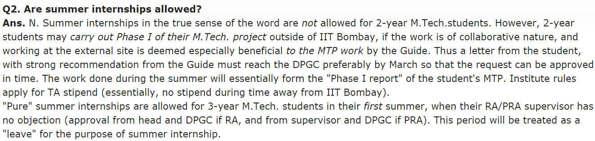

# TA vs RA #

1. If someone wants to go for Ph.D abroad after Masters, does RA make their profile stronger as compared to TA? Opposite? Same?
1. How different is the placement scenario b/w RA and TA?
1. What is the total intake of MTech CS at IITB? Last year, how many students were admitted under TA category and RA category?

# RA #

1. Let's say that I get into RA, and I am assigned some project X.  
    - Is it mandatory that I do my thesis in the same field?
    - Assuming the project incharge is ok with me doing my thesis under another prof, in a different field, what are the odds that this discussion and/or situation turns out well? And is there a precedence of such a case?
1. What happens if a RA project completes/is closed down, (assuming a few RAs are in their middle year of MTech)? Are they reassigned?
1. Are Mtech(RA) and Msc two separate things ? If yes what is the difference?
1. My understanding is
    
    > RAs are given a short presentation on each of the projects available in the college for RA, students are asked to make a priority list and attend interviews. If you clear the ones you opt for, you get RA.
    
    What if people clear more than 1 interview?

# TA #

1. Can someone expand on the Teaching Assistantship through Project (TAP) mentioned in brochure?
1. Can TA students participate in GSoC without violating the rules?  
    Don't we have summer vacations? What if someone wants to do an internship during that time?  
    
1. How are the project topic alloted for Mtech TA?  
    - Do we get to choose our own, or the professors give us the specific topic or some list to choose from?  
    - Do we get to choose the area(a particular field) to do project in?
1. While selecting courses for the sem, what all should one focus on?

# Courses #

1. What are these R&D projects?
    Total credit is given 6 in the page on clicking the course number, but given as 0 in the "More Info" links.
    Also, no other information is available.
    Which students are supposed to take these? What do these courses entail?  
    
1. How do prerequisites work? The ones for CS 709: Convex Optimization are "Basic courses on Linear Algebra and Calculus".
    Will UG courses of Maths I, II, and III be considered sufficient for it?  
    What happens if someone is unable to satisfy the prerequisites?
1. Which course is the institute elective?
1. How are course offerings decided? How are they expected to change in the coming 2-3 year?
    https://www.cse.iitb.ac.in/page135

# Placements #

1. Is there an eligibility criteria for **undergrad %** for placements? If someone has a lower %/GPA that this in undergrad, is he debarred from campus placements?
1. Do Mtech students get offers from abroad and how do Mtech students get pre placement offers ?
1. Which profs have good contacts in foreign universities since recommendation from them for PhD will have great value?
